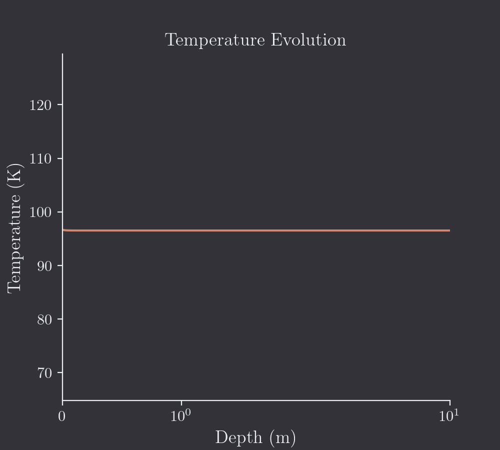

<div align="center">

# MultIHeaTS

MultIHeaTS is a Multi-layered Implicit Heat Transfer Solver. 

It is an implicit numerical model that simulates and predicts the surface temperature in 1D multi-layered planetary surfaces exposed to solar radiation.

[Getting started](#getting-started) •
[Installation](#installation) •
[How to Use](#how-to-use) •
[Configuration](#configuration) •
[License](#license)
</div>


# Getting Started


<div align="center">
 
</div>

Showcase of what the solver can output for a bi-layer surface profile on Japet. Note that here the interface is located around 32 cm.
Additional figures may be found in the *examples* directory.


## Dependencies

- python
- git

<details>
  <summary>Depecrated method</summary>

  If you want to use conda env:
  
  You can find conda at https://www.anaconda.com/ although I would suggest installing it directly from the command line.
Make sure conda is installed by tiping:
```bash
conda
```
It should return a help message.
</details>


## Installation

Copy the project localy using git clone:

```bash
git clone git@gitlab.dsi.universite-paris-saclay.fr:cyril.mergny/multiheats.git
```
then cd to the path of the repositery on you computer and create a venv environment:

```bash
cd path_to_multiheats/
python -m venv mheats
source mheats/bin/activate
```

To install the package then you just need to type:
```bash
pip install --upgrade pip
pip install -e .
```

<details>
  <summary>Click for conda install (Not recommended)</summary>


Install the required conda environment :

```bash
conda env create -f environment.yml
```
Please note that the environment.yml file has been deleted in newer versions. It can be found on older commits. Finally you need to make multiheats a python package by typing:
```bash
pip install -e .
```
</details>


# How to use
Make sure to activate the python environment before executing anything:
```bash
source mheats/bin/activate
```

There is an example script that you can run to see what the algorithm ouptut for a pre-defined profile.

```bash
cd path_to_multiheats/examples/
./run_example.sh
```
After iterating over all timestep the script should output matplotlib figures.

For more advance usage I recommand executing python directly in the *src* folder:

```bash
cd path_to_multiheats/src/multiheats/
python main.py
```

# Configuration

Currently you need to write you own personal modifications directly in the python scripts. A configuration file may come in later commits.

### Changing the Simulation Parameters

The latitude, longitude, emissivity of the surface, and the space array can be modified in the *__init__* method of the *Profile* class.

```python
def __init__(self) -> None:
    self.nx = 100
    self.lat = 0
    self.long = 0
    self.eps = 0.94  # Emissivity
    x0 = 0  # Surface depth (m)
    xf = 10  # Total depth (m)

    power = 4
    self.qheat = np.full(self.nx, 0)
    spaces = np.linspace(x0, xf ** (1 / power), self.nx)
    self.spaces = spaces ** (power)
    # prof.spaces = np.linspace(0, 2, self.nx)
```


### Changing the Surface Profiles

The solver is meant to be working for any type of multi-layered surfaces.
The surface material property profiles may be changed directly inside the *create_profile.py* python script.

For example to change the values of an homegeneous profile, change the variables *cond*, *rho*, *cp* in the method *monolayer_prof()*

```python
def monolayer_prof(self):
    """
    Generate an monolayered surface profile.
    PARAMS:
        cond - Conductivity (W.m-1.K-2)
        rho - Density (kg,m-3)
        cp - Heat capacity (J.kg-1.K-1)
    """
    cond = 0.01
    rho = 917.0
    cp = 839.0

    self.cond = np.full(self.nx, cond)
    self.rho = np.full(self.nx, rho)
    self.cp = np.full(self.nx, cp)
```

The same can be done for the bilayer profile: tweak the parameters in the method *bilayer_prof()*.

For any types of other exotic profiles (3 layers, etc...), feel free to write you own method in *Profile* class.

### Changing the Surface Flux

Flux are imported by the *solar_flux.py* module. Currently, the scripts import Japet solar flux and albedos from files in the *data* directory.

### Changing the Boundary Conditions

I would not recommend tweaking with the *solvers.py* module unless you know what you are doing. Anyway, the top and bottom boundary conditions may be change in the *set_flux_BC()* method.

```python
def set_flux_BC(self, matrice, source, dt):
    """
    Set boundary conditions for implicit Euler Scheme
    Imposed flux or imposed temperature possible.
    """
    rcoef = dt / self.rho / self.cp
    cond = self.cond

    # Set Boundary conditions
    bc_top = self.solar_flux / cond[0]
    bc_top += self.eps * cst.SIGMA / self.cond[0] * self.temp[0] ** 4
    self.bc_top = bc_top
    bc_bottom = 0
    ...
```
For example to add a radioactive thermal flux coming from the planet interior change bc_bottom to the flux' value.

The solvers is supposed to work with flux or temperature boundary conditions. Although for the second case some additional modifications may be required to make the solver work.

### Changing the Plot

Just modify or write you own functions in the *visualise.py* module.

### Changing the Main

Finally you may change other simulations parameters directly in the *main.py* script. For example, use it to switch between a monolayer or bilayer profile. Or to change the number of timestep used for iterations.

# Contributing

Contributions are welcome:

- Feel free to open an issue for feedback about usability.
- You may fork the project as you wish as long as you cite the original in your research.
- Pull request may be accepted if new features are in the scope of the MultIHeaTS core.

Please keep pull requests focused and don't change multiple things at the same
time.

# Citation

Article Submitted to Computational Geoscience !


# License

MultIHeaTS is distributed under the terms of the GNU GPL License Version 3. A complete version of the license is available in the COPYING file in this repository. Any contribution made to this project will be licensed under the GNU GPL License Version 3.
