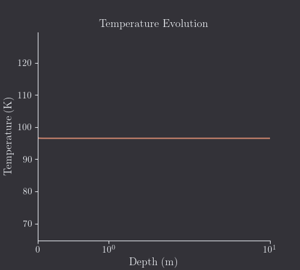

<div align="center">

# MultIHeaTS


MultIHeaTS is a Multi-layered Implicit Heat Transfer Solver. 


<div align="center">
   
</div>
<p>


It is an implicit numerical model that simulates and predicts the surface temperature in 1D multi-layered planetary surfaces exposed to solar radiation.


[Getting started](#getting-started) •
[Installation](#installation) •
[How to Use](#how-to-use) •
[Configuration](#configuration) •
[License](#license)
</div>


# Getting Started


<div align="center">
 
</div>

Showcase of what the solver can output for a bi-layer surface profile on Japet. Note that here the interface is located around 32 cm.
Additional figures may be found in the *examples* directory.


## Dependencies

- python
- git

<details>
  <summary>Depecrated method</summary>

  If you want to use conda env:
  
  You can find conda at https://www.anaconda.com/ although I would suggest installing it directly from the command line.
Make sure conda is installed by tiping:
```bash
conda
```
It should return a help message.
</details>


## Installation

Copy the project localy using git clone:

```bash
git clone git@github.com:cmergny/MultIHeaTS.git
```
then cd to the path of the repositery on you computer and create a python virtual environment. Feel free to use venv, conda or pyenv. I suggest going for pyenv with python 3.12.

Place yourself at the root of the directory and to install the multiheats package you just need to type:
```bash
pip install poetry --upgrade pip
poetry install --with dev
```

# How to use
Make sure to activate the python environment before executing anything.
There is an example script that you can run to see what the algorithm ouptut for a pre-defined profile.

```bash
cd path_to_multiheats/examples/
python example_1.py
```
After iterating over all timestep the script should output a matplotlib figure and an animation.


# Configuration

I suggest first copying the example_1.py file to use it as a template.
You can write you own personal modifications directly in the python code of this file.

### Changing the Simulation Parameters

The albedo, emissivity of the surface, depth array, etc... can be modified as shown in the examples/example_1.py file.

```python
# PARAMETERS
nx = 100  # Grid points
xmin, xmax = 0, 2  # depth limits (m)
alb = 0.2  # Albedo
eps = 1.0  # Emissivity
nday = 200  # Nbr of days
step_per_day = int(1e2)  # Points per day
distance = 9.51 * cst.UA  # Distance to sun (m)
period = 79.3 * cst.EARTH_DAY  # Diurnal period (s)

# TOP
cond_top = 0.01
rho_top = 917.0
cp_top = 839
# BOTTOM
cond_bot = cond_top / 2
rho_bot = rho_top / 2
```

### Changing the Surface Profiles

The solver is meant to be working for any type of multi-layered surfaces.
The surface material property profiles may be changed directly inside the *create_profile.py* python script.

For example to change the values of an homegeneous profile, change the arguments *cond*, *rho*, *cp* of the method *monolayer_prof()*
The same can be done for the bilayer profile: change the arguments of the method *bilayer_prof()*.
For any types of other exotic profiles (3 layers, etc...), feel free to write you own method in *Profile* class.

### Changing the Surface Flux

The solar flux can either be imported from data that you own, or created artificially using a truncated cosinus function. 

### Changing the Boundary Conditions

I would not recommend tweaking with the *solvers.py* module unless you know what you are doing. Anyway, the top and bottom boundary conditions may be change in the *set_flux_BC()* method (see bc_bottom var).

```python
    def set_flux_BC(self, rcoef, solar_flux):
        """
        Set boundary conditions for implicit Euler Scheme
        Imposed flux or imposed temperature possible.
        """

        self.bc_bottom = 0
    ...
```
For example to add a radioactive thermal flux coming from the planet interior change bc_bottom to the flux' value.

The solvers is supposed to work with flux or temperature boundary conditions. Although for the second case some additional modifications may be required to make the solver work.

### Changing the Plot

Just modify or write you own functions in the *visualise.py* module.

# Contributing

Contributions are welcome:

- Feel free to open an issue for feedback about usability.
- You may fork the project as you wish as long as you cite the original in your research.
- Pull request may be accepted if new features are in the scope of the MultIHeaTS core.

Please keep pull requests focused and don't change multiple things at the same
time.

# Citation

If you use this code or parts of this code in your work, please cite the following article:

C. Mergny and F. Schmidt, *MultIHeaTS: A Fast and Stable Thermal Solver for Multilayered Planetary Surfaces*, PSJ, DOI [10.3847/PSJ/ad6d6e](https://iopscience.iop.org/article/10.3847/PSJ/ad6d6e), 2024

# License

MultIHeaTS is distributed under the terms of the GNU GPL License Version 3. A complete version of the license is available in the COPYING file in this repository. Any contribution made to this project will be licensed under the GNU GPL License Version 3.
